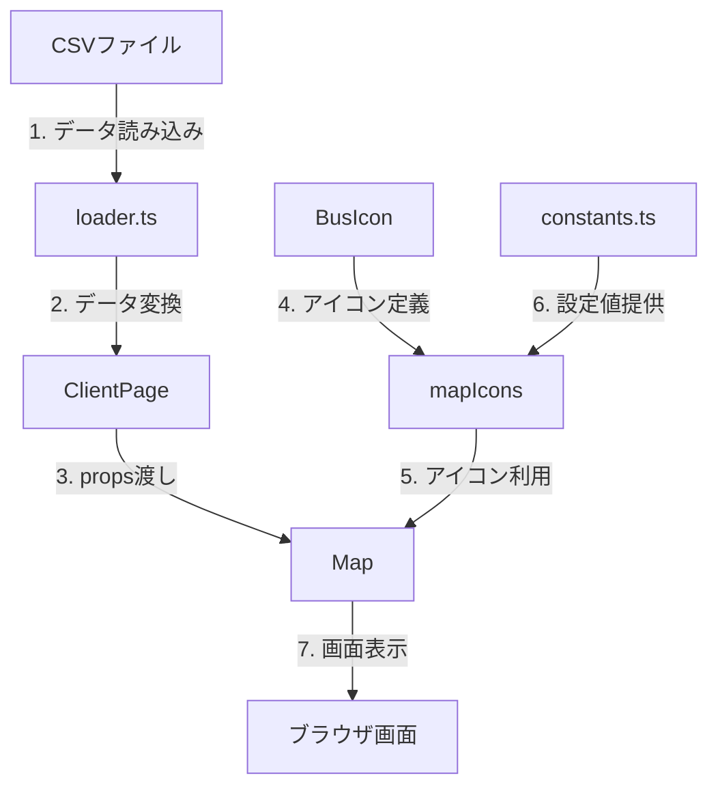
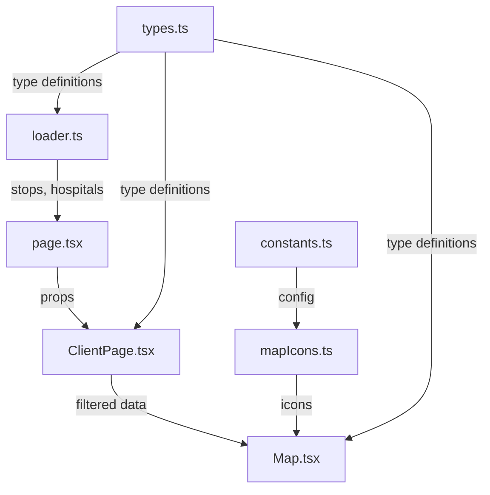

# 地図上のピン表示の仕組みについて

本ドキュメントでは、小山市の病院マップにおける地図上のピン（マーカー）表示の仕組みについてご説明いたします。WEB アプリケーションの技術的な知識が少ない方にもご理解いただけるよう、できるだけ詳しく解説させていただきます。

## アプリケーションの全体像

このアプリケーションは、以下の主要な機能を持っています：

1. 地図上での病院とバス停の表示
2. バス停からの徒歩圏内の可視化
3. 診療科目での病院の検索
4. 病院の詳細情報の表示

これらの機能は、複数のプログラムファイル（コンポーネント）が協力して実現しています。

## バス停アイコンの表示の仕組み

### 1. アイコンのデザイン（BusIcon.tsx）

バス停を表すアイコンは、SVG（Scalable Vector Graphics）という形式で定義されています。SVG は拡大しても画質が劣化しない画像形式です。

```typescript
export function BusIcon({ size = 30, color = "#2563EB" }) {
  return (
    <svg width={size} height={size} viewBox="0 0 24 24" fill={color}>
      <path d="..." /> // バスの形状を表すSVGパス
    </svg>
  );
}
```

このコンポーネントは以下のパラメータをカスタマイズできます：

- `size`: アイコンのサイズ（ピクセル単位）。指定がない場合は 30 ピクセル
- `color`: アイコンの色（CSS 色指定）。指定がない場合は青色（#2563EB）

### 2. 設定値の管理（constants.ts）

アプリケーション全体で使用する設定値は、一箇所にまとめて管理されています：

```typescript
export const ICON_CONFIG = {
  DEFAULT_SIZE: 20, // アイコンの標準サイズ
  BUS_COLOR: "#2563EB", // バスアイコンの色（青）
  HOSPITAL_COLOR: "#DC2626", // 病院アイコンの色（赤）
  HOSPITAL_OUT_OF_RANGE_COLOR: "#9CA3AF", // 徒歩圏外の病院の色（グレー）
};

export const MAP_CONFIG = {
  CENTER: [36.3139684166666, 139.815920027777], // 小山市の中心座標
  DEFAULT_ZOOM: 13, // 地図の初期表示時の拡大レベル
  WALKING_DISTANCES: {
    徒歩5分: 417, // 人の平均歩行速度（5km/h）で5分間に進む距離
    徒歩10分: 833, // 10分間に進む距離
  },
};
```

これにより：

- 設定値が一箇所にまとまっているので、変更が容易
- 同じ値を複数の場所で使用しても、タイプミスを防げる
- 設定の意図が分かりやすい（コメントで説明可能）

### 3. データの読み込み（loader.ts）

バス停の情報は、CSV（Comma-Separated Values）形式のファイルから読み込まれます。CSV は表計算ソフトでも編集できる形式です：

```typescript
type StopRecord = {
  stop_id: string; // バス停の一意識別子（他と重複しない番号）
  stop_name: string; // バス停名（例：「城山公園入口」）
  stop_desc: string; // 説明（例：「○○線」）
  stop_lat: number; // 緯度（例：36.3139684）
  stop_lon: number; // 経度（例：139.8159200）
};
```

データの読み込み手順：

1. `data/stops.csv`ファイルを開く
2. ファイルの内容を 1 行ずつ読み込む
3. 各行を JavaScript のオブジェクトに変換
4. 緯度・経度を文字列から数値に変換

### 4. 地図上での表示（Map.tsx）

地図の表示には「Leaflet」というライブラリを使用しています。実際の表示処理は以下の流れで行われます：

```typescript
{
  showCircles &&
    stops.map((stop) => (
      <Marker
        key={stop.stop_id}
        position={[stop.stop_lat, stop.stop_lon]}
        icon={mapIcons.bus}
      >
        <Popup>
          <div>
            <h3>{stop.stop_name}</h3>
            <p>{stop.stop_desc}</p>
          </div>
        </Popup>
      </Marker>
    ));
}
```

この処理の詳細：

1. `showCircles`が`true`の場合のみ実行（チェックボックスと連動）
2. 各バス停に対して：
   - 一意の ID（`key`）を設定して位置を特定
   - 緯度・経度の位置にマーカーを配置
   - バスのアイコンを設定
   - クリック時に表示する情報（ポップアップ）を設定

### 5. 表示の制御（ClientPage.tsx）

ユーザーの操作に応じた表示の制御は、React の「state（状態）」機能を使用しています：

```typescript
const [showCircles, setShowCircles] = useState(false);
```

この状態管理により：

- チェックボックスをクリックすると`showCircles`の値が切り替わる
- `showCircles`の値に応じて、以下の表示が変化：
  - バス停のアイコン
  - 徒歩圏内を示す円
  - 病院アイコンの色（圏内なら赤、圏外ならグレー）

## データの流れ

アプリケーション全体でのデータの流れを図示します：



1. アプリケーション起動時：

   - CSV ファイルからバス停と病院のデータを読み込み
   - 文字列を数値に変換するなど、必要な形式に変換
   - エラーがあれば適切に処理（例：ファイルが見つからない場合）

2. コンポーネントの初期化：

   - ClientPage でデータを受け取り、状態（state）として保持
   - 検索条件やフィルターの状態を管理
   - 子コンポーネントにデータを渡す準備

3. 地図表示：
   - Map コンポーネントで地図を初期化
   - バス停と病院のマーカーを配置
   - 徒歩圏内の円を描画
   - ユーザーの操作（ズーム、パン、クリックなど）に応じて表示を更新

## パフォーマンスの考慮

アプリケーションが快適に動作するための工夫：

- アイコンは再利用可能なコンポーネントとして実装
  - 同じアイコンを何度も作り直さない
  - メモリ使用量を抑制
- 設定値は一箇所で管理
  - 変更が容易
  - バグの発生を防止
- 必要な時のみ再描画
  - 無駄な画面更新を防止
  - スムーズな動作を実現
- データの効率的な管理
  - 必要なデータのみを保持
  - メモリの使用を最適化

## エラーハンドリング

予期せぬ問題が発生した場合の対策：

- データ読み込み時のエラー処理
  - ファイルが存在しない場合
  - データの形式が不正な場合
  - 文字コードの問題がある場合
- 不正な座標値のチェック
  - 緯度・経度が範囲外の場合
  - 数値に変換できない場合
- 必須データの検証
  - 必要な情報が欠けていないか確認
  - 型の安全性を確保

## 技術スタックの詳細

このアプリケーションで使用している主な技術：

- Next.js
  - React ベースのフレームワーク
  - ページの高速な表示が可能
  - 開発効率の向上
- Leaflet
  - オープンソースの地図ライブラリ
  - 軽量で高機能
  - カスタマイズが容易
- Material-UI
  - Google のマテリアルデザインを実装
  - 美しい UI コンポーネント
  - レスポンシブ対応
- TypeScript
  - JavaScript に型を追加
  - バグの早期発見
  - コードの保守性向上

このように、複数のコンポーネントとモジュールが協調して動作することで、
効率的で保守性の高いバス停表示機能を実現しています。

## 変数と依存関係の詳細

### マーカーアイコンの生成（mapIcons.ts）

`mapIcons`は`src/lib/mapIcons.ts`で定義されています：

```typescript
// SVGアイコンをLeaflet用のマーカーアイコンに変換する関数
export function createDivIcon(
  Icon: IconComponent, // SVGコンポーネント（BusIconなど）
  options: { color: string; size: number } // アイコンの色とサイズ
) {
  // ... アイコン生成ロジック
}

// アプリケーション全体で使用するアイコン定義
export const mapIcons = {
  bus: createDivIcon(BusIcon, {
    color: ICON_CONFIG.BUS_COLOR,
    size: ICON_CONFIG.DEFAULT_SIZE,
  }),
  hospital: createDivIcon(HospitalIcon, {
    color: ICON_CONFIG.HOSPITAL_COLOR,
    size: ICON_CONFIG.DEFAULT_SIZE,
  }),
};
```

### データの流れと変数の定義

1. **バス停データ（stops）**

   - 定義場所: `src/lib/loader.ts`の`loadStops()`関数
   - データソース: `data/stops.csv`
   - 型定義: `Stop[]`（`src/lib/types.ts`で定義）
   - 利用場所:
     - `page.tsx`でロード
     - `ClientPage.tsx`で受け取り
     - `Map.tsx`でマーカー表示に使用

2. **表示制御フラグ（showCircles）**

   - 定義場所: `src/components/ClientPage.tsx`
   - 初期値: `false`
   - 型: `boolean`
   - 用途: バス停と徒歩圏内の表示/非表示を制御
   - 変更タイミング: ヘッダーのチェックボックスクリック時

3. **マーカーアイコン（mapIcons.bus）**

   - 定義場所: `src/lib/mapIcons.ts`
   - 依存コンポーネント: `BusIcon.tsx`
   - 設定値: `ICON_CONFIG`（`constants.ts`）
   - 用途: バス停のマーカー表示

4. **位置情報（stop_lat, stop_lon）**
   - データ元: CSV ファイル
   - 型: `number`
   - 変換: `loader.ts`で文字列から数値に変換
   - 用途: マーカーの配置位置の指定

### コンポーネント間のデータの受け渡し



1. **ページロード時**:

   ```typescript
   // page.tsx
   const [stops, hospitals] = await Promise.all([
     loadStops(), // CSV からバス停データを読み込み
     loadHospitals(), // CSV から病院データを読み込み
   ]);
   ```

2. **クライアントコンポーネントへの受け渡し**:

   ```typescript
   // ClientPage.tsx
   export default function ClientPage({
     initialHospitals, // 病院データ
     stops, // バス停データ
   }: ClientPageProps) {
     // ... 状態管理と表示制御
   }
   ```

3. **地図コンポーネントでの利用**:
   ```typescript
   // Map.tsx
   export default function Map({
     hospitals, // フィルタリング済みの病院データ
     stops, // バス停データ
     showCircles, // 表示制御フラグ
     walkingDistance, // 徒歩圏内の距離
   }: MapProps) {
     // ... マーカーとポップアップの表示
   }
   ```

### 型定義（types.ts）

アプリケーション全体で使用される型定義：

```typescript
export type Stop = {
  stop_id: string;
  stop_name: string;
  stop_desc: string;
  stop_lat: number;
  stop_lon: number;
  zone_id: string;
  location_type: number;
};

export type Hospital = {
  prefecture: string;
  city: string;
  name: string;
  // ... 他の病院情報
};
```

これらの型定義により：

- データ構造の一貫性を保証
- 開発時のコード補完が有効
- 型関連のバグを事前に防止

## 主要な変数の定義と流れ

### 1. バス停データ（stops）の流れ

1. **データの定義元**:

   ```csv:data/stops.csv
   stop_id,stop_name,stop_desc,stop_lat,stop_lon,...
   1,城山公園入口,小山市コミュニティバス,36.3139684,139.8159200,...
   ```

2. **データの読み込みと型変換** (`src/lib/loader.ts`):

   ```typescript
   export async function loadStops(): Promise<Stop[]> {
     // CSVファイルを読み込み
     const fileContent = fs.readFileSync("data/stops.csv", "utf-8");
     // CSVをJavaScriptオブジェクトに変換
     const records = parse(fileContent, { columns: true });
     // 数値の変換などを行い、型定義に合わせる
     return records.map((record: StopRecord) => ({
       stop_id: record.stop_id,
       stop_name: record.stop_name,
       stop_lat: Number(record.stop_lat), // 文字列から数値に変換
       stop_lon: Number(record.stop_lon),
       // ... その他のフィールド
     }));
   }
   ```

3. **アプリケーションへの読み込み** (`src/app/page.tsx`):
   ```typescript
   export default async function Home() {
     // ページロード時にデータを読み込む
     const stops = await loadStops();
     return <ClientPage stops={stops} />;
   }
   ```

### 2. マーカーアイコン（mapIcons）の生成過程

1. **アイコンの SVG 定義** (`src/components/icons/BusIcon.tsx`):

   ```typescript
   export function BusIcon({ size = 30, color = "#2563EB" }) {
     return (
       <svg width={size} height={size} viewBox="0 0 24 24" fill={color}>
         <path d="..." /> // バスの形状
       </svg>
     );
   }
   ```

2. **アイコン設定の定義** (`src/lib/constants.ts`):

   ```typescript
   export const ICON_CONFIG = {
     DEFAULT_SIZE: 20,
     BUS_COLOR: "#2563EB",
     // ... その他の設定
   };
   ```

3. **Leaflet 用マーカーアイコンの生成** (`src/lib/mapIcons.ts`):

   ```typescript
   // SVGをLeafletのアイコンに変換する関数
   function createDivIcon(Icon: IconComponent, options: IconOptions) {
     return divIcon({
       html: renderToStaticMarkup(
         <Icon size={options.size} color={options.color} />
       ),
       className: "custom-icon",
       iconSize: [options.size, options.size],
     });
   }

   // アプリケーション全体で使用するアイコン定義
   export const mapIcons = {
     bus: createDivIcon(BusIcon, {
       color: ICON_CONFIG.BUS_COLOR,
       size: ICON_CONFIG.DEFAULT_SIZE,
     }),
     // ... 他のアイコン
   };
   ```

### 3. 変数の利用

これらの変数は最終的に`Map.tsx`で使用されます：

```typescript
export default function Map({ stops, showCircles }: MapProps) {
  return (
    <MapContainer>
      {showCircles &&
        stops.map((stop) => (
          <Marker
            key={stop.stop_id}
            position={[stop.stop_lat, stop.stop_lon]}
            icon={mapIcons.bus} // ここでアイコンを使用
          >
            {/* ... ポップアップの内容 ... */}
          </Marker>
        ))}
    </MapContainer>
  );
}
```

### データの流れの概要

1. **stops 変数**:

   - CSV → loader.ts → page.tsx → ClientPage.tsx → Map.tsx
   - 各段階で必要な変換や加工が行われる

2. **mapIcons 変数**:
   - BusIcon.tsx + constants.ts → mapIcons.ts → Map.tsx
   - SVG から Leaflet 用のアイコンに変換される

このように、データとアイコンは別々の経路で生成・加工され、最終的に地図コンポーネントで組み合わされて表示されます。
